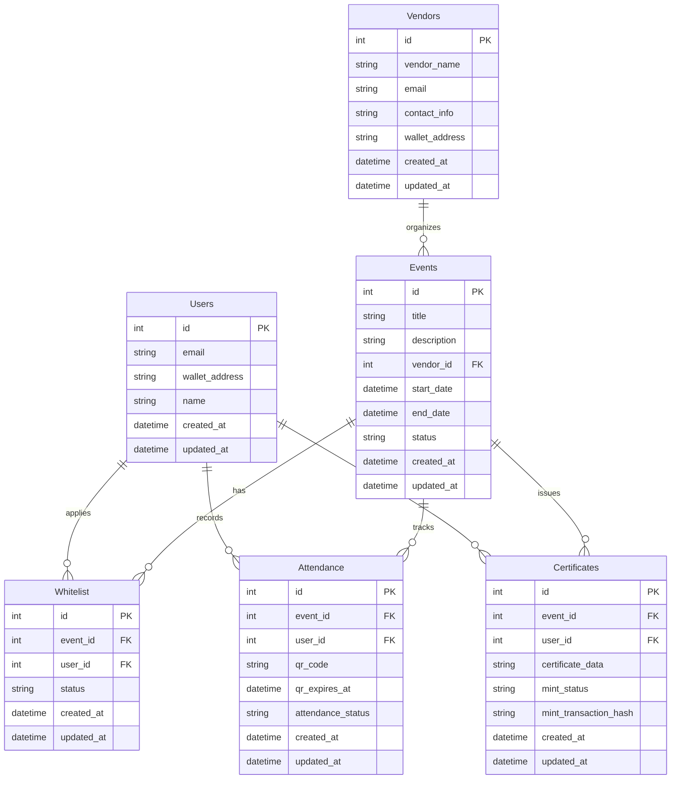

# Struktur Tabel Database

## Tabel

1. **Users**
   - `id` (Primary Key)
   - `email` (Optional)
   - `wallet_address` (Unique)
   - `name` (Required)
   - `created_at`
   - `updated_at`

2. **Vendors**
   - `id` (Primary Key)
   - `vendor_name` (Required)
   - `email` (Required)
   - `contact_info` (Optional)
   - `wallet_address` (Unique)
   - `created_at`
   - `updated_at`

3. **Events**
   - `id` (Primary Key)
   - `title` (Required)
   - `description` (Optional)
   - `vendor_id` (Foreign Key to Vendors)
   - `start_date` (Required)
   - `end_date` (Required)
   - `status` (enum: 'upcoming', 'ongoing', 'completed')
   - `created_at`
   - `updated_at`

4. **Whitelist**
   - `id` (Primary Key)
   - `event_id` (Foreign Key to Events)
   - `user_id` (Foreign Key to Users)
   - `status` (enum: 'pending', 'approved', 'rejected')
   - `created_at`
   - `updated_at`

5. **Attendance**
   - `id` (Primary Key)
   - `event_id` (Foreign Key to Events)
   - `user_id` (Foreign Key to Users)
   - `qr_code` (Required)
   - `qr_expires_at` (Required)
   - `attendance_status` (enum: 'present', 'absent')
   - `created_at`
   - `updated_at`

6. **Certificates**
   - `id` (Primary Key)
   - `event_id` (Foreign Key to Events)
   - `user_id` (Foreign Key to Users)
   - `certificate_data` (JSON or Text)
   - `mint_status` (enum: 'pending', 'minted', 'failed')
   - `mint_transaction_hash` (Optional)
   - `created_at`
   - `updated_at`

## Diagram Mermaid

## Flow Aplikasi

1. **Vendor Flow**
   - Register akun vendor (wallet + data vendor)
   - Login sebagai vendor
   - Buat event baru
   - Generate QR code untuk presensi (berubah setiap 15/30 detik)
   - Verifikasi kehadiran peserta
   - Approve whitelist peserta

2. **User Flow**
   - Register akun user (wallet + data user)
   - Login sebagai user
   - Lihat daftar event
   - Daftar whitelist event yang diinginkan
   - Scan QR code untuk presensi saat event
   - Mint certificate setelah event selesai (jika hadir)

3. **Keamanan & Validasi**
   - QR code berubah setiap 15/30 detik
   - Validasi kehadiran wajib untuk mint certificate
   - Whitelist harus disetujui vendor
   - Wallet address harus terverifikasi 